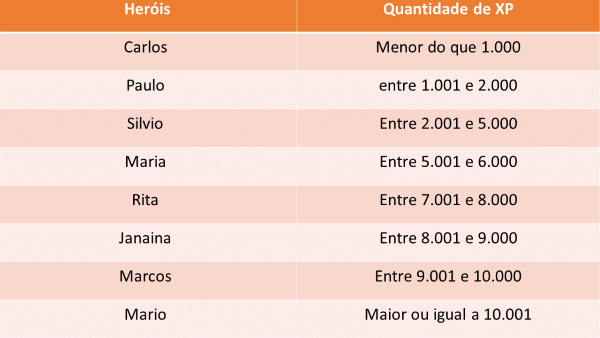

# Classificador de Herói

## Descrição:

O Desafio proposto consiste em exibir o nome do Héroi
e seu nível. Quando o programa é iniciado é solicitado
ao usuário alguns dados e o mesmo tem como apoio as informações
necessárias para executá-lo.

<ul>
    <li>Se quantidade de xp for menor que 1000, nível = Ferro</li>
    <li>Se a quantidade de xp for entre 1.001 e 2.000, nível = Bronze </li>
    <li>Se a quantidade de xp for entre 2.001 e 5.000, nível = Prata</li>
    <li>Se a quantidade de xp for entre 5.001 e 6.000, nível = Ouro</li>
    <li>Se a quantidade de xp for entre 7.001 e 8.000, nível = Platina Diamante</li>
    <li>Se a quantidade de xp for entre 8.001 e 9.000, nível = Ascendente</li>
    <li>Se a quantidade de xp for entre 9.001 e 10.000, nível = Imortal</li>
    <li>Se a quantidade de xp for maior ou igual a 10.001, nível = Imortal</li>
</ul>

## A figura abaixo mostra os dados necessários para testar o programa

## Como executar o programa?

primeiro é necessário ter o <strong>nodeJs</strong> instalado na máquina e você pode obte-lo em : <a href="https://nodejs.org/en" target= "_blank">NodeJS</a>

Tendo instalado o nodejs é só clonar o repositório para sua máquina e no git bash ou terminal digitar: <strong>npm install</strong> para termos acesso a todos os pacotes externos necessários para rodar o
projeto, depois é só digitar <strong>node index.js</strong> e o programa será executado.

